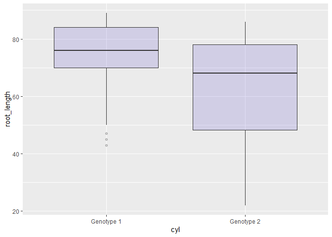
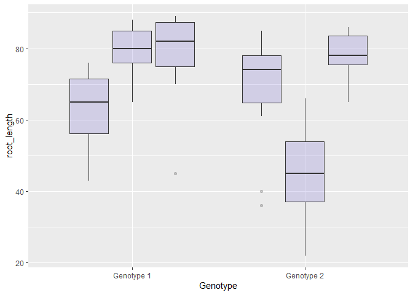
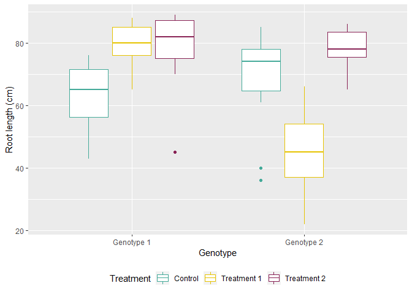

<style>
div.blue { background-color:#e6f0ff; border-radius: 5px; padding: 20px;}
</style>
<div class = "blue">

**Objectives of today's lesson:**

  - Set the working directory
  - Read data into R
  - Assign values to a variable
  - Plot the data using the package ggplot2

</div>

## Introduction to R

R is a programming language designed for data analysis and statistics. Due to time constraints, today's lesson will describe generic programming language concepts at a high level. We're going to learn how to set the working directory, load data into R, and then visualise that data using the [basic boxplot code](https://www.r-graph-gallery.com/262-basic-boxplot-with-ggplot2.html) from [Data to Viz](https://www.data-to-viz.com/). 

If you've already come to a workshop, today's session is hopefully a nice refresher of the basics.

### Setting the working directory

The first thing we need to do is to set the working directory. Your working directory is the folder on your computer containing the files you want to work on. This can be done in two ways:

The first way is easy and requires no programming.

1. Click the ... icon to the right under the 'Files' tab 
2. Navigate to the folder containing the files you want to work on
3. Click the 'More' option and select "Set as working directory"
4. Your working directory is now set

The second way is setting the working directory programmatically. To do this, we need to know the location of the folder containing our files. There are other ways to do this, but here's one:

1. Right click the folder containing the files you want to work on
2. Select "Properties"
3. The "Location" is the path needed to set the working directory programmatically

The location (path) is provided as an argument to the function setwd() and replicates what we did above. 


```r
setwd("/Volumes/NO NAME")
```

Once the working directory is set using either method, we can look at the names of the files contained within the folder using list.files(). The output will appear in the console. 


```r
list.files()
```

If you're somehow lost and cannot remember where your working directory is, the function getwd() will tell you where it is.


```r
getwd()
```

```
## [1] "/Volumes/NO NAME"
```

***

### Loading data into R
The data for this lesson is my own. This experiment was designed to test whether there is a difference between control vs. treatment and whether different genotypes respond differently to the same treatment. I measured weight, root length, and the number of lateral roots. Root length and number of lateral roots were divided to calculate lateral root density. The data is stored in a comma-separated values (CSV) format and each row holds the data for just one plant. Each column holds a different identifier - genotype, treatment, or parameter (any of weight, root length, etc). For the purposes of this exercise, it was captured at a single time point. Here's how the the data frame looks:


Genotype      Plate  Treatment    plant_weight   root_length   lateral_number   lateral_density
-----------  ------  ----------  -------------  ------------  ---------------  ----------------
Genotype 1        1  Control               3.8            57                7             0.123
Genotype 1        1  Control               6.2            73               11             0.151
Genotype 1        1  Control               5.3            65               12             0.185
Genotype 1        1  Control               3.6            60               10             0.167
Genotype 1        1  Control               2.5            50                7             0.140
Genotype 1        1  Control               6.2            71               14             0.197

We're going to load this data into R using a function called read.csv()


```r
read.csv(file = "experiment_1_raw_data.csv", header = TRUE)
```

You may have noticed that this function takes multiple arguments. We don't need to satisfy all of them for the function to work, right now providing 'file' and 'header' will do.

When this code is executed, the output will appear in the console. This provides an opportunity to check that we have loaded the right file, but the data cannot be used unless it's assigned to a variable.

***

### Assigning things to a variable

I personally like to think of variables as nicknames or shortcuts to access data or values. Some liken it to a container with a name that contains data or values. New variables (nicknames) can be created and assigned values using <- or =.

<style>
div.gray { background-color:#a0a0a0; border-radius: 2px; padding: 5px;}
</style>
<div class = "blue">
**The keyboard shortcut for the assignment operator is alt + - (Windows)** 
</div>
<br>
I often wonder how old I would be if I lived on Mercury. Mercury orbits the Sun in just 88 Earth days! To get my age in Mercurian years, I need to calculate my age in days and divide that result by 88. 

Let's assign our age to a variable:


```r
# this exercise assumes I'm exactly 28 years old and that there are no leap years
my_age <- 28
```

The variable my_age contains the value 28. Because I stored my age in the variable my_age, I don't need to keep typing 28. While this is currently inconvenient as the variable name is longer than the information stored within it, having it stored is important as it means that it isn't a hard-coded value. It reduces the risk of mis-typing my age and getting the wrong result at the end. Understanding assigning variables is an extremely important concept in programming.


```r
# multiply the variable my_age by 365 to get age in days
my_age_days <- my_age * 365

# let's also assign the number of Earth days in a Mercurian year to a variable
mercurian_year_days <- 88
```

Above we can see that R understands we're not attempting to multiply the variable 'my_age' by 365, but rather the information stored within the variable. The equation (my_age * 365) is nonsense otherwise without the value within the variable.


```r
mercurian_age <- my_age_days / mercurian_year_days

paste("My age on Mercury:", mercurian_age, "years")
```

```
## [1] "My age on Mercury: 116.136363636364 years"
```

Once again, R has accessed the values stored within the variable names to meaningfully calculate our Mercurian ages. 

We can use functions inside of other functions to pretty up the result if there are too many decimal places. Here we're going to use round() to reduce the number of decimal places to 2.

```r
# using the round() function to reduce the number of decimal places
paste("My age on Mercury:", round(mercurian_age, 2), "years")
```

```
## [1] "My age on Mercury: 116.14 years"
```


Now let's assign our data frame to a variable.


```r
df_1 <- read.csv(file = "experiment_1_raw_data.csv", header = TRUE)
```

Once the data has been loaded into R, we need to do some checking to ensure everything looks as expected. The functions dim() (dimensions of your data frame) or str() (structure of your data frame) are both very useful. I prefer str() as it's more informative and shows the data class of each column. head() and tail() can also be used to look at the top and bottom of the data frame.

The output of str(df1) shows us that this variable is a data frame with X observations of Y variables. It provides each of the column names as well as the class or type of data in that column. All of the columns containing numerical data (our parameters) are class 'num' which is short for numeric.


```r
str(df_1)
```

```
## 'data.frame':	121 obs. of  7 variables:
##  $ Genotype       : Factor w/ 2 levels "Genotype 1","Genotype 2": 1 1 1 1 1 1 1 1 1 1 ...
##  $ Plate          : int  1 1 1 1 1 1 2 2 2 2 ...
##  $ Treatment      : Factor w/ 3 levels "Control","Treatment 1",..: 1 1 1 1 1 1 1 1 1 1 ...
##  $ plant_weight   : num  3.8 6.2 5.3 3.6 2.5 6.2 2.6 4.3 4.7 7 ...
##  $ root_length    : int  57 73 65 60 50 71 50 43 64 74 ...
##  $ lateral_number : int  7 11 12 10 7 14 5 1 11 13 ...
##  $ lateral_density: num  0.123 0.151 0.185 0.167 0.14 0.197 0.1 0.023 0.172 0.176 ...
```

```r
# the top of the data frame
head(df_1)
```


Genotype      Plate  Treatment    plant_weight   root_length   lateral_number   lateral_density
-----------  ------  ----------  -------------  ------------  ---------------  ----------------
Genotype 1        1  Control               3.8            57                7             0.123
Genotype 1        1  Control               6.2            73               11             0.151
Genotype 1        1  Control               5.3            65               12             0.185
Genotype 1        1  Control               3.6            60               10             0.167
Genotype 1        1  Control               2.5            50                7             0.140
Genotype 1        1  Control               6.2            71               14             0.197

```r
# the bottom of the data frame
tail(df_1)
```

      Genotype      Plate  Treatment      plant_weight   root_length   lateral_number   lateral_density
----  -----------  ------  ------------  -------------  ------------  ---------------  ----------------
116   Genotype 2        3  Treatment 2            13.4            84               17             0.202
117   Genotype 2        3  Treatment 2            13.6            75               22             0.293
118   Genotype 2        3  Treatment 2            10.8            76               21             0.276
119   Genotype 2        3  Treatment 2            13.6            86               18             0.209
120   Genotype 2        3  Treatment 2            11.3            81               16             0.198
121   Genotype 2        3  Treatment 2            12.3            80               17             0.213

By default, head() and tail() show 6 rows. If you'd like it to display more, you can specify after df_1. Let's show the first 10 rows. 


```r
head(df_1, 10)
```


Genotype      Plate  Treatment    plant_weight   root_length   lateral_number   lateral_density
-----------  ------  ----------  -------------  ------------  ---------------  ----------------
Genotype 1        1  Control               3.8            57                7             0.123
Genotype 1        1  Control               6.2            73               11             0.151
Genotype 1        1  Control               5.3            65               12             0.185
Genotype 1        1  Control               3.6            60               10             0.167
Genotype 1        1  Control               2.5            50                7             0.140
Genotype 1        1  Control               6.2            71               14             0.197
Genotype 1        2  Control               2.6            50                5             0.100
Genotype 1        2  Control               4.3            43                1             0.023
Genotype 1        2  Control               4.7            64               11             0.172
Genotype 1        2  Control               7.0            74               13             0.176


***

## Pretty graphs with ggplot2

Base R certainly has graphing capabilites, but graphs produced using the package ggplot2 are customisable to the nth degree. Below is an example of a graph made using base R. 

<!-- -->

While this may be enough for some purposes, sometimes we want to make something more tailored. For example, I always use the same colours for genotypes and treatments in all my graphs regardless of the type of graph I'm making. Let's go ahead and install and load the package ggplot2. The function install.packages() downloads packages from repositories and installs them. Here's a [more comprehensive introduction to ggplot2](https://uc-r.github.io/ggplot_intro)

Today we're going to use code from the resource [Data to Viz](https://www.data-to-viz.com/), more specifically the [basic boxplot with ggplot2](https://www.r-graph-gallery.com/262-basic-boxplot-with-ggplot2.html). This will demonstrate how easy it is to find code online and adapt it for your own purposes.


```r
# install the package ggplot2
# installing packages only needs to be done once
install.packages("ggplot2")
```


```r
# load the package so we can use its functions
# loading packages needs to be done at the start of each session
library(ggplot2)

# the code for this boxplot can be found here:
# https://www.r-graph-gallery.com/262-basic-boxplot-with-ggplot2.html
ggplot(df_1, aes(x = as.factor(Genotype), 
                 y = root_length)) + 
    geom_boxplot(fill = "slateblue", alpha = 0.2) + 
    xlab("cyl")
```

<!-- -->


From the code we copied from Data-to-Viz, all we had to change at this step was the data to be plotted, the x and y axes. This graph is certainly what we're after, but it's not correct. The x axis displays genotypes 1 and 2, but all of the treatments are merged into each other. There should be three distinct boxplots within each genotype. Let's add a few extra graph elements to fix this. 


```r
ggplot(df_1, aes(x = as.factor(Genotype), 
                 y = root_length,
                 factor = Treatment)) + #
    geom_boxplot(fill = "slateblue", alpha = 0.2) + 
    xlab("Genotype") #
```

<!-- -->


Here 'factor = Treatment' was added to the graph aesthetics to tease apart my treatments and the xlab (x axis label) was changed to something more accurate. 
<br>

Now let's change the colours to reflect the different treatments, give a better Y axis label, and put the legend at the bottom of the graph.


```r
ggplot(df_1, aes(x = as.factor(Genotype), 
                 y = root_length,
                 factor = Treatment,
                 colour = Treatment)) + 
    geom_boxplot(fill="#FFFFFF", alpha=1.0) + 
    xlab("Genotype") +
    ylab("Root length (cm)") +
    scale_colour_manual(values = c("#44aa99", "#e6c300", "#882255"),
                    labels = c("Control", "Treatment 1", "Treatment 2")) +
    theme(legend.position = "bottom")
```

<!-- -->


You can continue to customise this graph to remove the grey grid background or put the legend position wherever you'd like. This can be done within theme().

***

### Resources:

Software Carpentry's 'Introduction to Programming with R' course material was used as a reference for this lesson plan. See <http://swcarpentry.github.io/r-novice-inflammation/>.

Data visualisation options with R code to produce the selected graph <https://www.data-to-viz.com/>.

This document was produced in R using R Markdown.

- For more details on using R Markdown see <http://rmarkdown.rstudio.com>.

- If you're really keen on pretty R Markdown documents see <https://holtzy.github.io/Pimp-my-rmd/>. 

Data frames were rendered using the package lemon.

